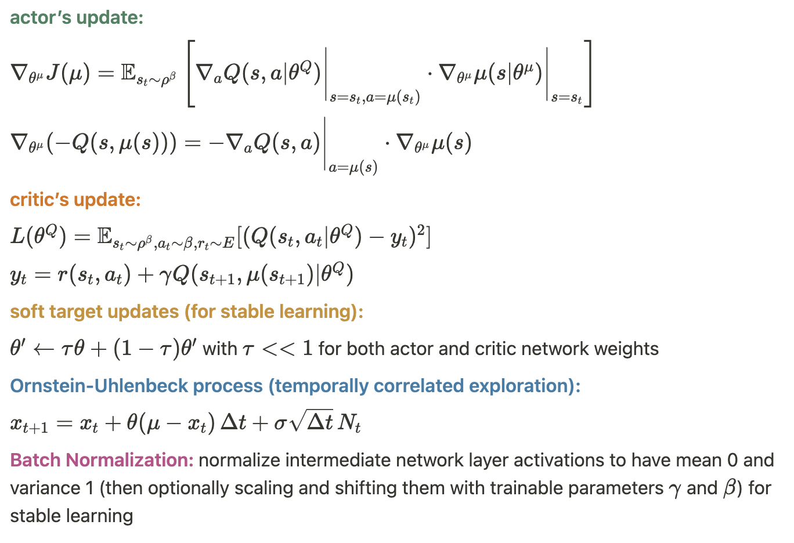
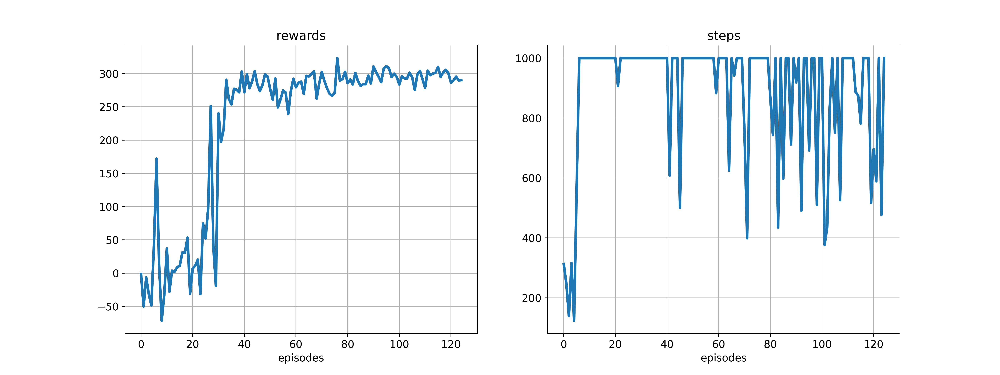

### reference

https://github.com/jdlowman2/rl4robotics

### environment

macOS Apple M1 (8 cpu cores)

python 3.7.16 (conda env)

gym 0.26.2 (pip install 'gym[box2d]’)

torch 1.13.1

### tested gym env

[box2d](https://www.gymlibrary.dev/environments/box2d/index.html)

[lunar_lander](https://www.gymlibrary.dev/environments/box2d/lunar_lander/)

env=gym.make("LunarLanderContinuous-v2")

**RL hyperparameters:**

lr_mu 0.0001, lr_q 0.001, gm 0.99, tau 0.001, buffer_size 1000000, min_memo_size 2000

ou noise: theta 0.15, sigma 0.2, decay 0.0, sigma_min 0.15

1 run = 2500 episodes

### execution and code diagram

python ddpg_skinny.py

    pytorch_ddpg_explanation/
    ├── ddpg_skinny.py
        ├── update_grads()
        ├── train() - main func

    ├── actor_critic_networks.py - network structure
    ├── noise_process.py - ou noise generator
    ├── memory.py - replay buffer

### network

      Actor(
        (layer1): Linear(in_features=8, out_features=400, bias=True)
        (layer2): Linear(in_features=400, out_features=400, bias=True)
        (layer3): Linear(in_features=400, out_features=2, bias=True)
      )
      Critic(
        (layer1): Linear(in_features=8, out_features=400, bias=True)
        (layer2): Linear(in_features=402, out_features=400, bias=True)
        (layer3): Linear(in_features=400, out_features=1, bias=True)
      )

**inputs and outputs:**

      Actor model: mu(s)
      input: (8,) state
      output: (2,) deterministic continuous actions

      Critic model: Q(s,a)
      input: (s, a) pair - (8,)(2,)
      output: (1,) q-value

**initialization:** simple “fan-in” uniform initialization

### DDPG key points

### smoothed results

env=gym.make("LunarLanderContinuous-v2")

